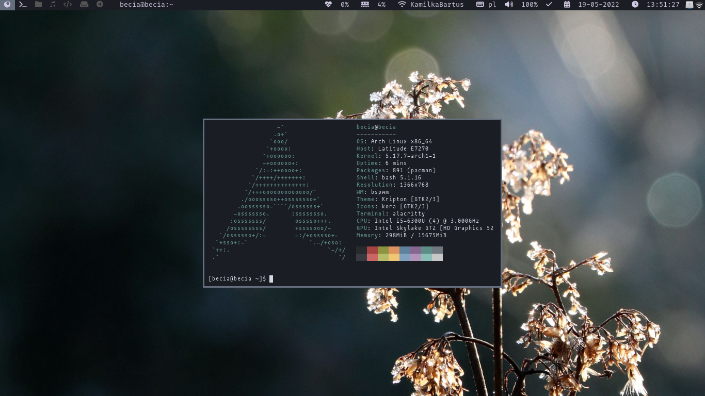
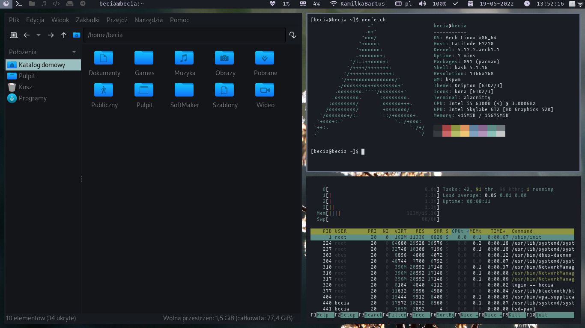

# [BSPWM-Rice] My Arch Linux dotfiles :)

I use Arch Linux with BSPWM + Polybar

If you want to get desktop look like mine you need to have:
* bspwm
* sxhkd
* polybar
* ttf-font-awesome
* Alacritty
* Kora Icon Pack
* Kripton Theme
* Rofi [comming_soon]

